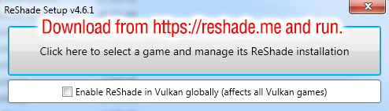
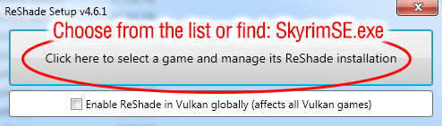

# Reshade Installation Steps

## Please follow the instructions here to install reshade with the required shaders for the list

Head over to <https://reshade.me> and download Reshade. Once it is done run the exe file and follow the instructions on the images below.

## Step 1

## Step 2

Select SkyrimSE in steam/steamapps/common/Skyrim Special Edition

## Step 3

Select Direct3D 10/11/12

## Step 4

Only follow whats selected. Ignore what isn't selected

## Step 5

Don't tick anything here

## Step 6

Only follow whats selected. Ignore what isn't selected

## Step 7

Only follow whats selected. Ignore what isn't selected

## Step 8

You are done. Head back to the post installation steps. You can close reshade now
